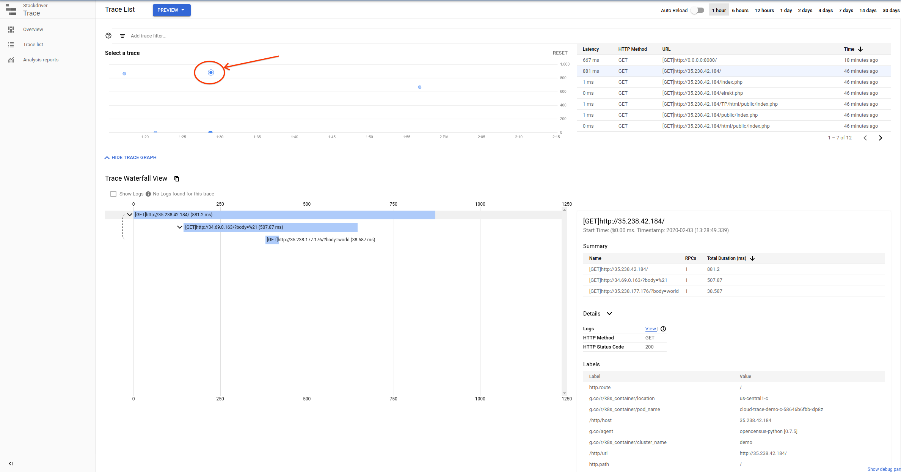

# cloud-trace-demo-app

Open this demo app in [Google Cloud Shell](https://cloud.google.com/shell/docs/). This includes necessary tools.

We provide a public image for the services in this demo app. You could also build
your own following steps 4 - 6.

#### Demo Requirements
If you are using Cloud Shell, skip to the next section.

1. Install gcloud <https://cloud.google.com/sdk/install>
2. Install kubectl <https://kubernetes.io/docs/tasks/tools/install-kubectl/>
3. Install docker <https://docs.docker.com/install/>

#### Google Container Registry Image Setup
If you are using the provided image, skip to the next section.

4. Get default project id and set environment variable:
    `PROJECT_ID=$(gcloud config get-value project)`
5. Build Image:
    `docker build -t gcr.io/${PROJECT-ID}/cloud-trace-demo .`
6. Upload Image to Container Registry:
    `gcloud docker -- push gcr.io/${PROJECT-ID}/cloud-trace-demo-test:v1`

#### Create a GKE cluster
7. Enable Google Cloud and set up region and zone.
    `gcloud init`
8. Enable the GKE API & billing:
    `gcloud services enable container.googleapis.com`
9. Create a GKE cluster named "demo":
    `gcloud container clusters create demo`

#### Send Requests to See Generated Traces

10. If you are using your own image, please change the image variable in the following files:
    * [YAML](./app/demo-service-a.yaml)
    * [template B](./app/demo-service-b.yaml.template)
    * [template C](./app/demo-service-c.yaml.template)
11. Run setup.sh to apply the YAML files.
    `./setup.sh`
12. Send request to the last service:

    `curl $(kubectl get svc cloud-trace-demo-a -ojsonpath='{.status.loadBalancer.ingress[0].ip}')`
13. Visit [Trace List](https://pantheon.corp.google.com/traces/list) to check traces generated.
    Click on any trace in the graph to see the Waterfall View.
    
14. Clean up GKE cluster/pods/services
    `gcloud container clusters delete demo`
